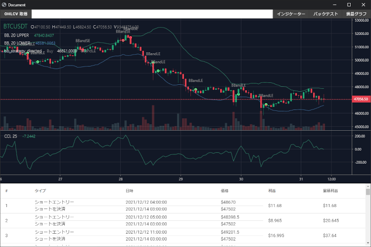

# BacktestView
このツールは仮想通貨のバックテストを見える化するためのツールです。

Python で書かれた仮想通貨ストラテジーをバックテストすることが出来ます。

# このツールで出来ること


## 1. OHLCV取得

指定期間のOHLCV取得してチャートに表示します。（現在Bybitの1時間足のみ）

## 2. インジケーター

指標をチャートに表示します。

## 3. バックテスト

Python で書かれた仮想通貨ストラテジーをバックテストしてチャートに表示します。

## 4. 損益グラフ

バックテストした結果の損益をグラフに表示します。


# 今後の課題
ホント必要最低限の機能しか作ってないので、もっと機能を増やしていく。
* OHLCV取得の機能追加（取引所追加、時間足選択、最新リアルタイム取得）
* インジケーターの追加
* バックテストの保存・読み込み・比較

# 開発環境構築手順
## 1. Python 仮想環境の導入
```
python -m venv env1
```

## 2. 必須モジュールの一括インストール
```
pip install -r requirements.txt
```

## 3. 実行
```
python BacktestView.py
```


# EXE化手順
## コンソール無し版
```
python -m eel BacktestView.py web --onefile --icon=Icojam-Animals-01-horse.ico --noconsole
```

## コンソールあり版
```
python -m eel BacktestView.py web --onefile --icon=Icojam-Animals-01-horse.ico
```
